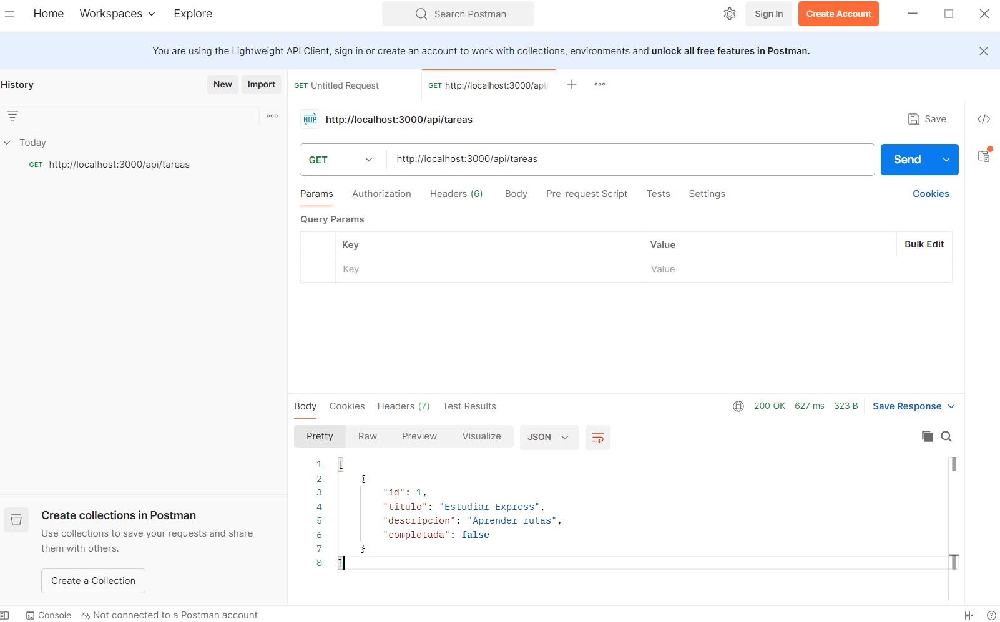
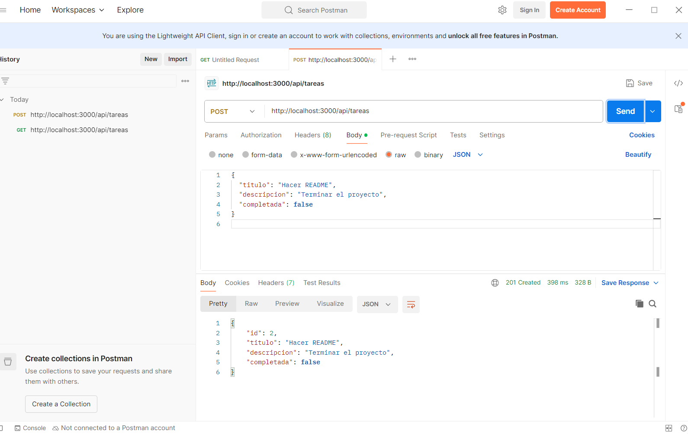
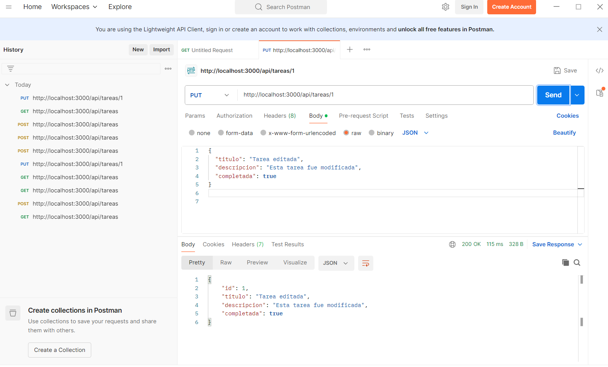
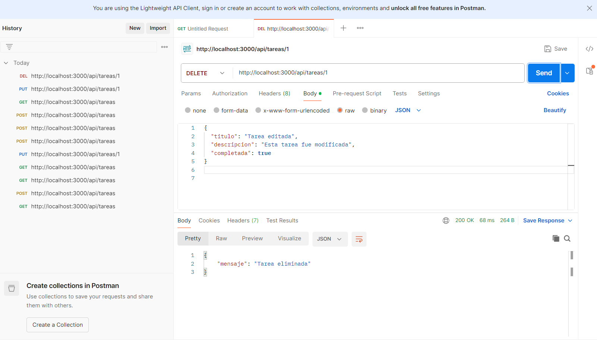

# API REST de Tareas – Node.js y Express

## Descripción del proyecto
Este proyecto corresponde a una API RESTful básica desarrollada con Node.js y Express. 
Permite gestionar una lista de tareas mediante operaciones CRUD (Crear, Leer, Actualizar y Eliminar), 
utilizando peticiones HTTP y respuestas en formato JSON.

Los datos se almacenan en memoria en un archivo JavaScript, sin utilizar base de datos ni autenticación.

---

## Tecnologías utilizadas
- Node.js
- Express.js
- JavaScript
- Postman

---

## Instalación

1. Clonar o descargar el repositorio.
2. Abrir la carpeta del proyecto en Visual Studio Code.
3. Abrir una terminal en la carpeta del proyecto.
4. Ejecutar:

```bash
npm install


## Pruebas realizadas en Postman

### GET – Listar tareas


### POST – Crear tarea


### PUT – Actualizar tarea


### PUT – Segunda prueba


### DELETE – Eliminar tarea

